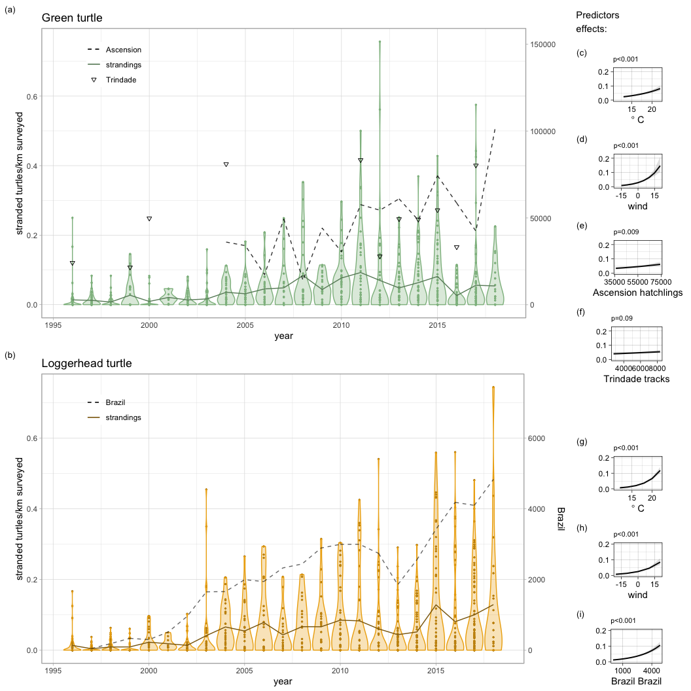
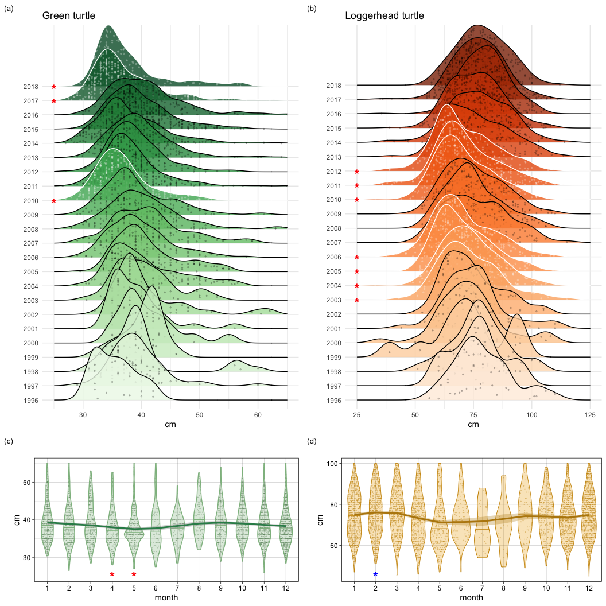
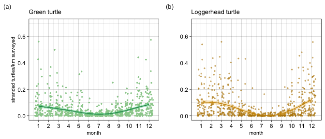
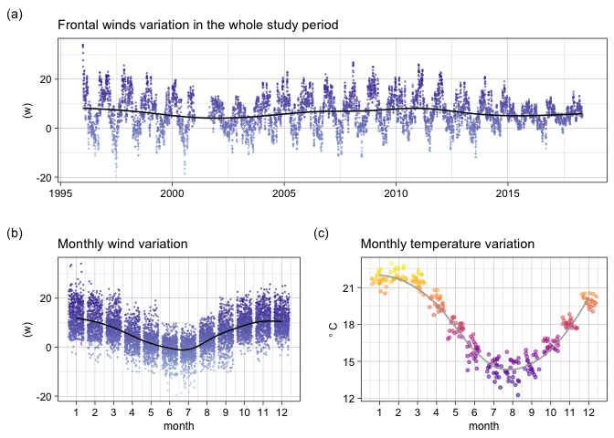

Are green and loggerhead strandings increasing due to population growth
in the southwestern Atlantic Ocean?
================
Pedro Blaya Luz

### Description

This repository contains analysis scripts from the article “*Are green
and loggerhead strandings increasing due to population growth in the
southwestern Atlantic Ocean?*” to be submitted to [Biological
Conservation](www.journals.elsevier.com/biological-conservation). The
analysis code is divided into several separate scripts, which are called
from
[main\_code.r](https://github.com/pedroblayaluz/strandings-RSC/blob/master/main_code.R),
to be more practical and reproducible.

The following is a demonstration of
[main\_code.r](https://github.com/pedroblayaluz/strandings-RSC/blob/master/main_code.R):

### Setting up the environment

``` r
#PREPARING WORKSPACE
rm(list=ls())
#Root directory
directory <- "~/Dropbox/Science/Turtles/Masters/strandings-RSC/"
#Sub-directories
dir.data <- paste0(directory,'data/') 
dir.sup <- paste0(directory,"plots and tables/supplementary material/")
dir.code <-  paste0(directory,"code/")
#Loading/installing missing packages
source(paste0(dir.code,'0_packages.r'))
```

### Data importing and processing

In
[1\_data\_processing.R](https://github.com/pedroblayaluz/strandings-RSC/blob/master/code/1_data_processing.R)
all .csv files inside the
[data](https://github.com/pedroblayaluz/strandings-RSC/tree/master/data)
folder are imported and processed into appropriate data.frames for
subsequent analysis:

  - `chelonia.strandings` and `caretta.strandings` are used to model
    strandings in response to reproductive and environmental predictors.
  - `chelonia.plot.data` and `caretta.plot.data` are used to plot
    strandings and reproductive data.
  - `chelonia.sizes` and `caretta.sizes` are used to model and plot sea
    turtles body sizes (CCLs).

It also returns a little summary of the turtles dataset.

``` r
#DATA IMPORT AND PROCCESSING
source(paste0(dir.code,'1_data_processing.r'))
```

    ## 907  beach surveys:  363   north  |  544   south

    ## 107870.3 kms covered

    ## 4406  green turtles stranded

    ## 3752  green turtle CCLs

    ## 6177 loggerhead turtles stranded

    ## 4391 loggerhead CCLs

Let’s take a look at `chelonia.strandings` and `caretta.strandings`

``` r
tail(as_tibble(chelonia.strandings))
```

    ## # A tibble: 6 x 12
    ##    year month   day date       area      n    km group   w10   sst Ascension
    ##   <int> <int> <int> <date>     <chr> <dbl> <dbl> <chr> <dbl> <dbl>     <int>
    ## 1  2017     9    14 2017-09-14 north     5    53 sulc…  6.48  15.8     42282
    ## 2  2017     9     8 2017-09-08 north     5    82 nort…  8.78  15.8     42282
    ## 3  2017     9    27 2017-09-27 north     3    46 sulc…  4.78  15.8     42282
    ## 4  2017     2     3 2017-02-03 north     0    52 sulc…  5.74  22.9     42282
    ## 5  2017     6    22 2017-06-22 north     2    54 sulc…  2.07  16.5     42282
    ## 6  2017     9    21 2017-09-21 north     3    85 nort…  2.85  15.8     42282
    ## # … with 1 more variable: Trindade <int>

``` r
tail(as_tibble(caretta.strandings))
```

    ## # A tibble: 6 x 11
    ##    year month   day date       area      n    km group         w10   sst Brazil
    ##   <int> <int> <int> <date>     <chr> <dbl> <dbl> <chr>       <dbl> <dbl>  <int>
    ## 1  2018     1    25 2018-01-25 north     1    87 nortececli3  3.63  21.7   4831
    ## 2  2018     3     8 2018-03-08 north     3    82 nortececli3  8.26  21.2   4831
    ## 3  2018     2     8 2018-02-08 south    62   142 nema        10.2   21.7   4831
    ## 4  2018     2     8 2018-02-08 north     0    83 nortececli3 10.2   21.7   4831
    ## 5  2018     1    17 2018-01-17 north     1    53 sulcecli3    3.22  21.7   4831
    ## 6  2018     1    31 2018-01-31 north     6    53 sulcecli3    7.41  21.7   4831

### Statistical modeling

In
[2\_statistical\_modelling.R](https://github.com/pedroblayaluz/strandings-RSC/blob/master/code/2_statistical_modelling.R)
four statistical models are adjusted:

  - One model for each species’ strandings

<!-- end list -->

``` r
#Green
cm.strandings.model <- glm.nb(n~offset(log(km))+sst+w10+Trindade+Ascension,
                              data=chelonia.strandings)
#Loggerhead
cc.strandings.model <- glm.nb(n~offset(log(km))+sst+w10+Brazil,
                              data=caretta.strandings)
```

  - One model for each species’ body sizes

<!-- end list -->

``` r
#Green
cm.sizes.model <- lm(ccl~as.factor(year)+as.factor(month),
                     data=chelonia.sizes)
#Loggerhead
cc.sizes.model <- lm(ccl~as.factor(year)+as.factor(month), data=caretta.sizes)
```

It also returns a little summary of the modeled data:

``` r
#STATISTICAL MODELINGggpredict()
source(paste0(dir.code,'2_statistics.r'))
```

    ## strandings model sample sizes and timespans

    ## 2820 green turtles

    ## 2004, 2011, 2012, 2013, 2014, 2015, 2016, 2017

    ## 6106 loggerhead turtles

    ## 1997-2018

### Plots

In
[3\_plots.R](https://github.com/pedroblayaluz/strandings-RSC/blob/master/code/3_plots.R)
several plots are created. They are combined into two figures:

  - `strandings.plot` including strandings and reproductive data over
    time, along with the effects of each predictor over the number of
    strandings.

  - `sizes.plot` including temporal variations of turtles’ body sizes.

<!-- end list -->

``` r
#PLOTS
source(paste0(dir.code,'3_plots.r'))
```

### Let’s see the results

  - Green and loggerhead strandings, reproductive data and predicted
    values.

<!-- end list -->

``` r
#Strandings
strandings.plot
```



``` r
#Green strandings statistics
summary(cm.strandings.model)
```

    ## 
    ## Call:
    ## glm.nb(formula = n ~ offset(log(km)) + sst + w10 + Trindade + 
    ##     Ascension, data = chelonia.strandings, init.theta = 0.8686408465, 
    ##     link = log)
    ## 
    ## Deviance Residuals: 
    ##     Min       1Q   Median       3Q      Max  
    ## -2.1585  -1.1581  -0.4078   0.2346   3.8736  
    ## 
    ## Coefficients:
    ##               Estimate Std. Error z value Pr(>|z|)    
    ## (Intercept) -7.147e+00  5.807e-01 -12.308  < 2e-16 ***
    ## sst          1.381e-01  2.291e-02   6.029 1.65e-09 ***
    ## w10          8.241e-02  1.205e-02   6.838 8.05e-12 ***
    ## Trindade     5.590e-05  3.285e-05   1.702  0.08877 .  
    ## Ascension    1.591e-05  6.068e-06   2.622  0.00873 ** 
    ## ---
    ## Signif. codes:  0 '***' 0.001 '**' 0.01 '*' 0.05 '.' 0.1 ' ' 1
    ## 
    ## (Dispersion parameter for Negative Binomial(0.8686) family taken to be 1)
    ## 
    ##     Null deviance: 597.32  on 419  degrees of freedom
    ## Residual deviance: 464.03  on 415  degrees of freedom
    ## AIC: 2193.4
    ## 
    ## Number of Fisher Scoring iterations: 1
    ## 
    ## 
    ##               Theta:  0.8686 
    ##           Std. Err.:  0.0796 
    ## 
    ##  2 x log-likelihood:  -2181.3830

``` r
#Loggerhead strandings statistics
summary(cc.strandings.model)
```

    ## 
    ## Call:
    ## glm.nb(formula = n ~ offset(log(km)) + sst + w10 + Brazil, data = caretta.strandings, 
    ##     init.theta = 0.707322987, link = log)
    ## 
    ## Deviance Residuals: 
    ##     Min       1Q   Median       3Q      Max  
    ## -2.4373  -1.0931  -0.5508   0.2309   3.7568  
    ## 
    ## Coefficients:
    ##               Estimate Std. Error z value Pr(>|z|)    
    ## (Intercept) -1.003e+01  3.337e-01 -30.056  < 2e-16 ***
    ## sst          2.913e-01  1.839e-02  15.846  < 2e-16 ***
    ## w10          6.245e-02  8.597e-03   7.264 3.77e-13 ***
    ## Brazil       4.578e-04  3.627e-05  12.623  < 2e-16 ***
    ## ---
    ## Signif. codes:  0 '***' 0.001 '**' 0.01 '*' 0.05 '.' 0.1 ' ' 1
    ## 
    ## (Dispersion parameter for Negative Binomial(0.7073) family taken to be 1)
    ## 
    ##     Null deviance: 1426.56  on 837  degrees of freedom
    ## Residual deviance:  871.76  on 834  degrees of freedom
    ## AIC: 4047.4
    ## 
    ## Number of Fisher Scoring iterations: 1
    ## 
    ## 
    ##               Theta:  0.7073 
    ##           Std. Err.:  0.0478 
    ## 
    ##  2 x log-likelihood:  -4037.3690

``` r
#Body sizes
sizes.plot
```



``` r
#Loggerhead sizes model summary
summary(cm.sizes.model)
```

    ## 
    ## Call:
    ## lm(formula = ccl ~ as.factor(year) + as.factor(month), data = chelonia.sizes)
    ## 
    ## Residuals:
    ##     Min      1Q  Median      3Q     Max 
    ## -16.005  -3.901  -1.219   2.337  85.180 
    ## 
    ## Coefficients:
    ##                     Estimate Std. Error t value Pr(>|t|)    
    ## (Intercept)         42.18456    1.35174  31.208  < 2e-16 ***
    ## as.factor(year)1997 -0.63349    1.52267  -0.416 0.677406    
    ## as.factor(year)1998 -1.00697    1.71870  -0.586 0.557985    
    ## as.factor(year)1999 -1.62926    1.71450  -0.950 0.342031    
    ## as.factor(year)2000 -0.66691    2.11664  -0.315 0.752719    
    ## as.factor(year)2001  1.94508    1.75804   1.106 0.268627    
    ## as.factor(year)2002 -0.01974    1.53770  -0.013 0.989759    
    ## as.factor(year)2003 -1.26738    1.63563  -0.775 0.438472    
    ## as.factor(year)2004 -1.02101    1.42111  -0.718 0.472519    
    ## as.factor(year)2005 -0.60193    1.42628  -0.422 0.673030    
    ## as.factor(year)2006 -1.27546    1.44223  -0.884 0.376554    
    ## as.factor(year)2007 -0.25318    1.44987  -0.175 0.861385    
    ## as.factor(year)2008 -1.30820    1.40616  -0.930 0.352258    
    ## as.factor(year)2009 -2.41750    1.42150  -1.701 0.089089 .  
    ## as.factor(year)2010 -4.67366    1.37524  -3.398 0.000685 ***
    ## as.factor(year)2011 -2.95596    1.36294  -2.169 0.030160 *  
    ## as.factor(year)2012 -2.70107    1.42338  -1.898 0.057820 .  
    ## as.factor(year)2013 -1.77447    1.38446  -1.282 0.200026    
    ## as.factor(year)2014 -2.95199    1.37035  -2.154 0.031290 *  
    ## as.factor(year)2015 -1.37970    1.35415  -1.019 0.308333    
    ## as.factor(year)2016 -1.24658    1.41694  -0.880 0.379040    
    ## as.factor(year)2017 -4.20160    1.36283  -3.083 0.002064 ** 
    ## as.factor(year)2018 -3.86318    1.47306  -2.623 0.008763 ** 
    ## as.factor(month)2   -0.85677    0.46484  -1.843 0.065387 .  
    ## as.factor(month)3   -0.24056    0.47018  -0.512 0.608942    
    ## as.factor(month)4   -1.64593    0.52373  -3.143 0.001687 ** 
    ## as.factor(month)5   -2.11306    0.50224  -4.207 2.65e-05 ***
    ## as.factor(month)6   -1.93916    0.80351  -2.413 0.015854 *  
    ## as.factor(month)7   -0.42031    0.74789  -0.562 0.574154    
    ## as.factor(month)8    1.41102    0.71065   1.986 0.047159 *  
    ## as.factor(month)9   -0.38514    0.55862  -0.689 0.490585    
    ## as.factor(month)10   0.11190    0.48806   0.229 0.818674    
    ## as.factor(month)11  -0.92629    0.43615  -2.124 0.033752 *  
    ## as.factor(month)12  -1.00914    0.41911  -2.408 0.016096 *  
    ## ---
    ## Signif. codes:  0 '***' 0.001 '**' 0.01 '*' 0.05 '.' 0.1 ' ' 1
    ## 
    ## Residual standard error: 6.571 on 3718 degrees of freedom
    ## Multiple R-squared:  0.05899,    Adjusted R-squared:  0.05063 
    ## F-statistic: 7.062 on 33 and 3718 DF,  p-value: < 2.2e-16

``` r
#Green sizes model summary
summary(cc.sizes.model)
```

    ## 
    ## Call:
    ## lm(formula = ccl ~ as.factor(year) + as.factor(month), data = caretta.sizes)
    ## 
    ## Residuals:
    ##     Min      1Q  Median      3Q     Max 
    ## -55.837  -8.260  -1.132   7.665  39.684 
    ## 
    ## Coefficients:
    ##                     Estimate Std. Error t value Pr(>|t|)    
    ## (Intercept)         79.29496    1.86172  42.592  < 2e-16 ***
    ## as.factor(year)1997 -2.53318    2.83607  -0.893  0.37180    
    ## as.factor(year)1998 -1.66865    2.63740  -0.633  0.52697    
    ## as.factor(year)1999 -6.85881    3.88074  -1.767  0.07723 .  
    ## as.factor(year)2000 -5.90289    2.54136  -2.323  0.02024 *  
    ## as.factor(year)2001 -4.07769    2.44028  -1.671  0.09479 .  
    ## as.factor(year)2002 -5.21702    2.37061  -2.201  0.02781 *  
    ## as.factor(year)2003 -6.01450    2.19252  -2.743  0.00611 ** 
    ## as.factor(year)2004 -6.07738    1.95927  -3.102  0.00194 ** 
    ## as.factor(year)2005 -8.70106    1.99826  -4.354 1.37e-05 ***
    ## as.factor(year)2006 -9.19838    1.98248  -4.640 3.59e-06 ***
    ## as.factor(year)2007 -3.41995    2.15867  -1.584  0.11320    
    ## as.factor(year)2008 -4.25670    2.03971  -2.087  0.03695 *  
    ## as.factor(year)2009 -4.66620    2.01505  -2.316  0.02062 *  
    ## as.factor(year)2010 -8.55873    1.96306  -4.360 1.33e-05 ***
    ## as.factor(year)2011 -7.79401    1.92975  -4.039 5.46e-05 ***
    ## as.factor(year)2012 -8.57829    2.05951  -4.165 3.17e-05 ***
    ## as.factor(year)2013 -3.11521    2.06221  -1.511  0.13096    
    ## as.factor(year)2014 -1.89434    1.96593  -0.964  0.33531    
    ## as.factor(year)2015 -3.15813    1.90135  -1.661  0.09679 .  
    ## as.factor(year)2016 -0.01225    1.93231  -0.006  0.99494    
    ## as.factor(year)2017 -1.98295    1.88151  -1.054  0.29198    
    ## as.factor(year)2018 -1.69044    1.97640  -0.855  0.39242    
    ## as.factor(month)2    2.03518    0.69571   2.925  0.00346 ** 
    ## as.factor(month)3    1.71686    0.71034   2.417  0.01569 *  
    ## as.factor(month)4   -0.56541    0.75265  -0.751  0.45256    
    ## as.factor(month)5   -2.16581    0.90981  -2.381  0.01733 *  
    ## as.factor(month)6   -2.88299    1.30469  -2.210  0.02718 *  
    ## as.factor(month)7   -5.10829    2.39009  -2.137  0.03263 *  
    ## as.factor(month)8   -4.76576    2.78209  -1.713  0.08678 .  
    ## as.factor(month)9    0.77466    1.59136   0.487  0.62643    
    ## as.factor(month)10   0.17749    0.88143   0.201  0.84042    
    ## as.factor(month)11  -0.84010    0.70590  -1.190  0.23406    
    ## as.factor(month)12  -0.02285    0.64213  -0.036  0.97161    
    ## ---
    ## Signif. codes:  0 '***' 0.001 '**' 0.01 '*' 0.05 '.' 0.1 ' ' 1
    ## 
    ## Residual standard error: 11.86 on 4357 degrees of freedom
    ## Multiple R-squared:  0.07441,    Adjusted R-squared:  0.0674 
    ## F-statistic: 10.61 on 33 and 4357 DF,  p-value: < 2.2e-16

### Supplementary material

The last script
[4\_supplementary\_material.R](https://github.com/pedroblayaluz/strandings-RSC/blob/master/code/3_supplementary_material.R)
creates Tables and Figures annexed as Supplementary material.

``` r
#SUPPLEMENTARY MATERIAL
source(paste0(dir.code,'4_supplementary_material.r'))
#Table summarising strandings and body sizes throughout time
complete.table
```

    ##          Green turtle                        Loggerhead                        
    ## 1   year   Strandings  Mean    SD  Min   Max Strandings  Mean    SD   Min   Max
    ## 2   1996           32 41.54 14.68   31    81         50 78.92 12.42    56   110
    ## 3   1997           78 41.06 10.43   29    98         32 76.38 11.01    59    96
    ## 4   1998           37 40.69  8.42   31    70         42 77.56 11.61    51 103.5
    ## 5   1999           36 40.31  3.34   32    46         14 72.25 16.76    39    95
    ## 6   2000           18 41.12  5.29   35    55         49 73.22 13.87    35   108
    ## 7   2001           38 43.38 12.41   34    80         63 74.77 12.84    44   110
    ## 8   2002           73 41.58  9.09   32    94         66 74.38 12.31    53   105
    ## 9   2003           45 40.39  5.02 30.6    53        101 73.05 13.03    43   115
    ## 10  2004          167 40.65  6.65   29  71.5        318 73.27 11.74 32.79   106
    ## 11  2005          160 40.89  5.46 29.5    55        290 70.66 11.63    52   109
    ## 12  2006          144 40.12  6.93   29    78        310 70.19 12.83  37.5 109.5
    ## 13  2007          134 41.24  6.27   29    59        138 76.29 13.54    51   115
    ## 14  2008          193 40.36   6.5   28    72        186 74.93 11.86    53 106.1
    ## 15  2009          159 39.16  5.69   29    61        237 75.03 12.29    47   110
    ## 16  2010          315 36.69  4.65   26    52        360 70.35 11.82    33   102
    ## 17  2011          438 38.14  4.88 26.5    65        449 71.39 13.05    36   110
    ## 18  2012          239  38.9  4.66   27  56.5        280 70.71 12.79    39   107
    ## 19  2013          295 39.99  6.86   29    96        219 75.94 13.36    40 113.5
    ## 20  2014          439 38.35  6.76   27    89        405 77.38 13.27    24   114
    ## 21  2015          631 39.93  7.73 24.8 125.6        817  75.9 11.58  20.3   108
    ## 22  2016          196 40.54  6.12   30    65        582 79.85  9.72  35.6   105
    ## 23  2017          415 37.13  5.96 27.5  70.5        802  77.3 10.72    35   111
    ## 24  2018          124 38.07  7.99 29.5    96        367 78.89 10.71    55   112
    ## 25 total         4406 39.23  6.74 24.8 125.6       6177 74.93 12.28  20.3   115

``` r
#Monthly strandings distribution
monthly.strandings
```

<!-- -->

``` r
#Temporal covariates distribution
covariates
```

<!-- -->
